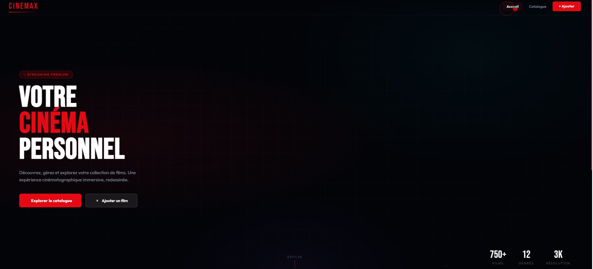
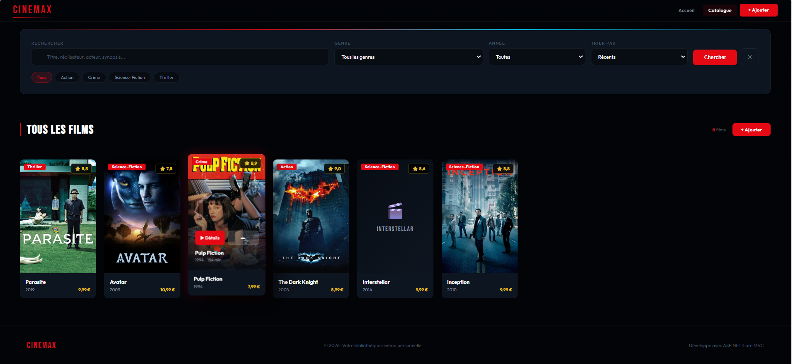
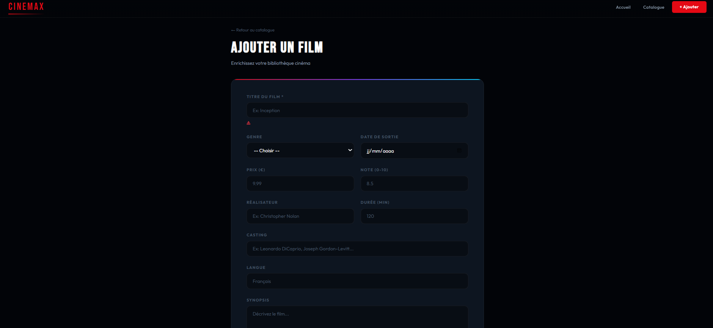

<div align="center">

# 🎬 CINEMAX

### A Netflix-Inspired Movie Management App

*Built with ASP.NET Core 8 MVC · Entity Framework Core · SQLite*

---



[](https://dotnet.microsoft.com)
[](https://learn.microsoft.com/en-us/dotnet/csharp/)
[](https://learn.microsoft.com/en-us/ef/core/)
[](https://www.sqlite.org/)
[](LICENSE)

</div>

---

## ✨ Overview

**CINEMAX** is a full-stack movie library application with an ultra-modern cinema aesthetic. Manage your personal movie collection with a rich UI featuring 3D card effects, animated transitions, and a custom cursor — all built with vanilla ASP.NET Core MVC, no frontend frameworks needed.

---

## 📸 Screenshots

### 🏠 Home Dashboard


### 🎬 Movie Catalog


### ➕ Add a Movie


---

## 🚀 Features

| Feature | Description |
|---|---|
| 🃏 **3D Card Effects** | CSS perspective tilt on every movie card |
| 🔍 **Advanced Search** | Search by title, director, actor or synopsis |
| 🎛️ **Filters & Sorting** | Filter by genre, year — sort by rating, title, date |
| 🎬 **Trailer Integration** | Embed YouTube trailers on every detail page |
| 🖼️ **Poster Upload** | Upload local images or paste a URL |
| ⭐ **Rating System** | Rate movies 0–10 with star display |
| 🔗 **Related Movies** | Auto-suggest movies from the same genre |
| 🖱️ **Custom Cursor** | Red animated cursor with follower ring |
| 🌟 **Scroll Animations** | Fade-in reveal as you scroll |
| 🍞 **Toast Notifications** | Success messages after every action |
| 📱 **Fully Responsive** | Mobile, tablet & desktop ready |
| 🎭 **6 Seed Movies** | Pre-loaded with Inception, Interstellar, Dark Knight & more |

---

## 🛠️ Tech Stack

| Layer | Technology |
|---|---|
| **Backend** | ASP.NET Core 8 MVC |
| **Language** | C# 12 |
| **ORM** | Entity Framework Core 8 |
| **Database** | SQLite (zero configuration) |
| **Frontend** | Razor Views + Vanilla CSS/JS |
| **Fonts** | Bebas Neue + Outfit (Google Fonts) |

---

## ⚡ Quick Start

### Prerequisites

- [.NET 8 SDK](https://dotnet.microsoft.com/download/dotnet/8.0) — download and install
- Visual Studio 2022 **or** VS Code **or** any terminal

---

### Option A — Visual Studio 2022 (Recommended)

```
1. Open the file: AppMovie.csproj
2. Press F5
3. The database is created automatically ✅
4. The browser opens at https://localhost:XXXX
```

---

### Option B — Terminal / VS Code

```bash
# 1. Clone the repository
git clone https://github.com/YOUR_USERNAME/cinemax-movie-app.git

# 2. Go into the project folder
cd cinemax-movie-app/AppMovie

# 3. Restore NuGet packages
dotnet restore

# 4. Run the app
dotnet run
```

Then open your browser at: **`https://localhost:5001`**

> ✅ The SQLite database is created **automatically** on first launch — no migration commands needed.

---

## 📁 Project Structure

```
AppMovie/
├── Controllers/
│   ├── HomeController.cs          # Home page
│   └── MoviesController.cs        # Full CRUD + search & filters
│
├── Data/
│   └── AppmovieContext.cs         # DbContext with 6 seed movies
│
├── Migrations/
│   └── 20260413000000_InitialCreate.cs
│
├── Models/
│   ├── Movie.cs                   # Movie model (poster, trailer, cast...)
│   └── ErrorViewModel.cs
│
├── Views/
│   ├── Home/
│   │   └── Index.cshtml           # Landing hero page
│   ├── Movies/
│   │   ├── Index.cshtml           # Catalog + search filters
│   │   ├── Details.cshtml         # Movie detail + trailer + related
│   │   ├── Create.cshtml          # Add movie form
│   │   ├── Edit.cshtml            # Edit movie form
│   │   └── Delete.cshtml          # Delete confirmation
│   └── Shared/
│       └── _Layout.cshtml         # Global navbar layout
│
├── wwwroot/
│   ├── css/cinemax.css            # 800+ lines ultra-modern CSS
│   ├── js/cinemax.js              # 3D effects, animations, cursor
│   └── uploads/                   # User-uploaded posters
│
├── Program.cs
├── appsettings.json
└── AppMovie.csproj
```

---

## 🎨 Design System

| Element | Value |
|---|---|
| **Background** | `#020408` (void black) |
| **Accent Red** | `#e50914` (Netflix red) |
| **Accent Cyan** | `#00d4ff` |
| **Gold** | `#f5c518` (IMDB gold) |
| **Display Font** | Bebas Neue |
| **Body Font** | Outfit |

---

## 📦 NuGet Packages

```xml
Microsoft.EntityFrameworkCore.Sqlite              8.0.0
Microsoft.EntityFrameworkCore.Design              8.0.0
Microsoft.EntityFrameworkCore.Tools               8.0.0
Microsoft.AspNetCore.Mvc.Razor.RuntimeCompilation 8.0.0
```

---

## 🎬 Pre-loaded Movies

The app comes with 6 classic movies ready to explore:

| # | Title | Genre | Rating |
|---|---|---|---|
| 1 | Inception | Sci-Fi | ⭐ 8.8 |
| 2 | Interstellar | Sci-Fi | ⭐ 8.6 |
| 3 | The Dark Knight | Action | ⭐ 9.0 |
| 4 | Pulp Fiction | Crime | ⭐ 8.9 |
| 5 | Avatar | Sci-Fi | ⭐ 7.8 |
| 6 | Parasite | Thriller | ⭐ 8.5 |

---

## 🔧 Troubleshooting

**❌ `no such table: Movie` error**

Delete these files from your project root if they exist:
```
AppMovie.db
AppMovie.db-shm
AppMovie.db-wal
```
Then restart the application — the database will be recreated automatically.

---

**❌ Port already in use**

Change the port in `Properties/launchSettings.json` or run:
```bash
dotnet run --urls "https://localhost:5002"
```

---

